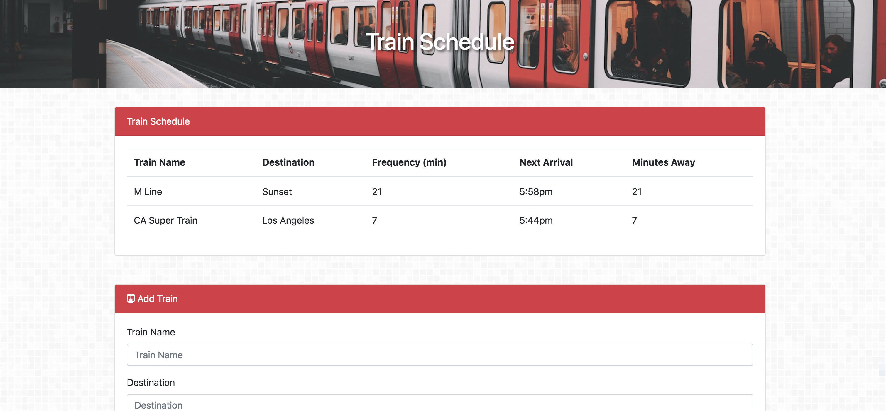

# Train Scheduler

Create a train and find out when it's next arriving!

[Live Site](https://acekreations.github.io/Giphy-Art/)

## Technology Used

- HTML
- CSS / Bootstrap
- JavaScript / JQuery
- [Moment JS](https://momentjs.com/) - For time formatting and conversion.

## Challenges

Moment JS proved to be difficult to grasp, but after repeatedly reading through the documentation and experimenting with code I was able to gain a fairly strong understanding of how it works. I had no idea how difficult it is to work with times and dates until this project. Now I have a significant appreciation for what Moment accomplishes, and in hind sight, how easy they make it.

## Author
Craig Melville
